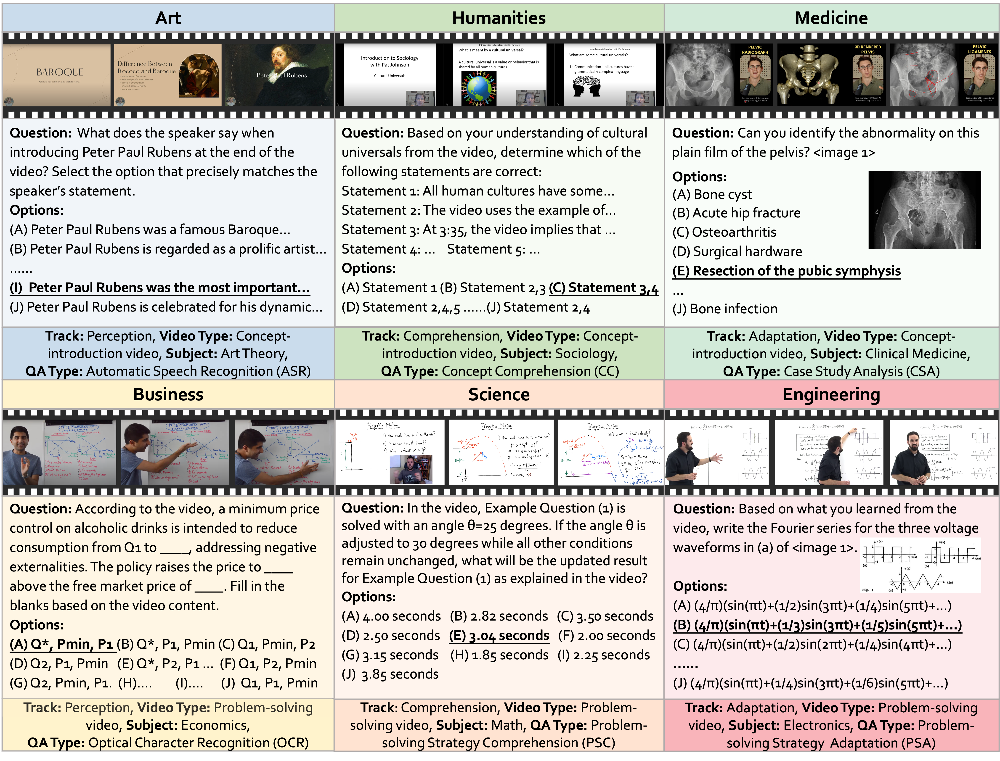

#  Video-MMMU: Evaluating Knowledge Acquisition from Multi-Discipline Professional Videos

<p align="center">
  <a href="https://videommmu.github.io/"></a>
  <a href="https://arxiv.org/abs/2501.13826"></a>
  <a href="https://huggingface.co/datasets/lmms-lab/VideoMMMU"></a>
  <a href="https://lmms-lab.framer.ai"></a>
  <a href="https://discord.gg/zdkwKUqrPy"></a>
</p>

🖋 [Kairui Hu](https://kairuihu.github.io/), [Penghao Wu](https://penghao-wu.github.io/), [Fanyi Pu](https://github.com/pufanyi), [Wang Xiao](https://www.ntu.edu.sg/s-lab), [Xiang Yue](https://xiangyue9607.github.io/), [Bo Li](https://brianboli.com/), [Yuanhan Zhang](https://zhangyuanhan-ai.github.io/), and [Ziwei Liu](https://liuziwei7.github.io/)

---

## 🔥 News
- [2025-3] 🎉🎉 We update Video-MMMU leaderboard to include [Kimi-k1.6-preview-20250308](https://github.com/MoonshotAI/Kimi-k1.5), [VideoLLaMA3-7B](https://huggingface.co/DAMO-NLP-SG/VideoLLaMA3-7B). Thanks for the acknowledgement to Video-MMMU!
- [2025-2] 🎉🎉 We update Video-MMMU leaderboard to include [Qwen-2.5-VL-72B](https://huggingface.co/Qwen/Qwen2.5-VL-72B-Instruct), [Qwen-2.5-VL-7B](https://huggingface.co/Qwen/Qwen2.5-VL-7B-Instruct),  [mPLUG-Owl3-7B](https://github.com/X-PLUG/mPLUG-Owl/tree/main/mPLUG-Owl3), [InternVideo2.5-Chat-8B](https://huggingface.co/OpenGVLab/InternVideo2_5_Chat_8B), [VideoChat-Flash-7B@448](https://huggingface.co/OpenGVLab/VideoChat-Flash-Qwen2-7B_res448). Thanks for the acknowledgement to Video-MMMU!
- [2025-1] 🎉🎉 We introduce [VideoMMMU](https://videommmu.github.io/), a multi-modal, multi-disciplinary video benchmark that evaluates the **knowledge acquisition capability** from educational videos.


## 🧠 Overview  
<div align="center">
    
</div>

Video-MMMU is the first benchmark to assess knowledge acquisition from educational videos, evaluating how well LMMs learn new knowledge from videos and apply what they learn in practice.

### 1) Knowledge-Intensive Video Collection
Video-MMMU features 300 **lecture-style videos** covering 6 professional disciplines—Art, Business, Science, Medicine, Humanities, and Engineering, spanning 30 subjects.

### 2) Knowledge Acquisition-Based Question Design  
Each video is accompanied by 3 QA pairs, designed to evaluate video-based learning at different cognitive levels:  
- **Perception** – Identifying key information.  
- **Comprehension** – Understanding underlying concepts.  
- **Adaptation** – Applying knowledge to new scenarios.  

This results in 900 question-answer pairs (300 videos × 3 QA pairs per video), systematically measuring a model's ability to acquire and apply knowledge from educational videos.  
 

## ❓QA Design
<div align="center">
    
</div>

**Perception**  
- ASR (Automatic Speech Recognition): The **Art** category (top left).  
- OCR (Optical Character Recognition): The **Business** category (bottom left).
  
**Comprehension**  
- Concept Comprehension: The **Humanities** category (top center).  
- Problem-Solving Strategy Comprehension: The **Science** category (bottom center).

**Adaptation**  
- Case Study Analysis: The **Medicine** category (top right).  
- Problem-Solving Strategy Adaptation: The **Engineering** category (bottom right).

<div align="center">
    
</div>

## 🔍 A New Perspective on VideoQA 

### Videos as a Knowledge Source
Traditional VideoQA benchmarks focus primarily on evaluating how well models interpret visual content. Video-MMMU is the first to treat videos as a **source of knowledge**, assessing how effectively LMMs acquire knowledge from educational videos.  

### Measuring Knowledge Gain: The Δknowledge Metric
A key novelty of Video-MMMU is that it evaluates not just a model’s absolute accuracy but also its **delta accuracy**—the improvement in performance after learning from a video. A model may initially fail to solve an exam question, but we give the model a video where a human could learn to solve the question by watching this video. Video-MMMU evaluates how well LMMs **improve their performance** after watching the relevant video. Video-MMMU introduces **Δknowledge** to quantify the model's learning gain on the Adaptation track questions. **Δknowledge** is defined as the normalized performance gain:

```math
$$
\Delta_{\text{knowledge}} = \frac{\text{Acc}_{\text{after\_video}} - \text{Acc}_{\text{before\_video}}}{100\% - \text{Acc}_{\text{before\_video}}} \times 100\%
$$

```


## 🛠️ Evaluation Pipeline
The evaluation of VideoMMMU is integrated into [LMMs-Eval](https://github.com/EvolvingLMMs-Lab/lmms-eval/tree/main). The detailed instructions of the evaluation are shown as follows.

### Installation

For formal usage, you can install the package from PyPI by running the following command:
```bash
pip install lmms-eval
```

For development, you can install the package by cloning the repository and running the following command:
```bash
git clone https://github.com/EvolvingLMMs-Lab/lmms-eval
cd lmms-eval
pip install -e .
```

If you want to test LLaVA, you will have to clone their repo from [LLaVA](https://github.com/haotian-liu/LLaVA) and
```bash
git clone https://github.com/LLaVA-VL/LLaVA-NeXT
cd LLaVA-NeXT
pip install -e .
```

### Evaluation

We use [LLaVA-OneVision-7B](https://huggingface.co/llava-hf/llava-onevision-qwen2-7b-ov-hf) as an example in the following commands. You can change `--model`, and `--model_args` based on your requirement.

**Evaluation of LLaVA-OneVision on VideoMMMU (all 3 tracks)**

```bash
accelerate launch --num_processes=1 --main_process_port 12345 -m lmms_eval \
--model llava_onevision \
--model_args pretrained=lmms-lab/llava-onevision-qwen2-7b-ov,conv_template=qwen_1_5,model_name=llava_qwen,max_frames_num=32,torch_dype=bfloat16 \
    --tasks video_mmmu \
    --batch_size 1 \
    --log_samples \
    --log_samples_suffix debug \
    --output_path ./logs/
```

**Evaluate a single track of VideoMMMU**

Perception track: 
```bash
accelerate launch --num_processes=1 --main_process_port 12345 -m lmms_eval \
--model llava_onevision \
--model_args pretrained=lmms-lab/llava-onevision-qwen2-7b-ov,conv_template=qwen_1_5,model_name=llava_qwen,max_frames_num=32,torch_dype=bfloat16 \
    --tasks video_mmmu_perception \
    --batch_size 1 \
    --log_samples \
    --log_samples_suffix debug \
    --output_path ./logs/
```

Comprehension track: 
```bash
accelerate launch --num_processes=1 --main_process_port 12345 -m lmms_eval \
--model llava_onevision \
--model_args pretrained=lmms-lab/llava-onevision-qwen2-7b-ov,conv_template=qwen_1_5,model_name=llava_qwen,max_frames_num=32,torch_dype=bfloat16 \
    --tasks video_mmmu_comprehension \
    --batch_size 1 \
    --log_samples \
    --log_samples_suffix debug \
    --output_path ./logs/
```

Adaptation track: 
```bash
accelerate launch --num_processes=1 --main_process_port 12345 -m lmms_eval \
--model llava_onevision \
--model_args pretrained=lmms-lab/llava-onevision-qwen2-7b-ov,conv_template=qwen_1_5,model_name=llava_qwen,max_frames_num=32,torch_dype=bfloat16 \
    --tasks video_mmmu_adaptation \
    --batch_size 1 \
    --log_samples \
    --log_samples_suffix debug \
    --output_path ./logs/
```

**Evaluate the question_only track of VideoMMMU -- Knowledge Acquisition Experiment (∆knowledge)**

The "question_only" track consists of 2-second videos that contain only the image associated with the Adaptation Track question. This is the baseline for ∆knowledge.

To evaluate this setting, you can use the following command:

```bash
accelerate launch --num_processes=1 --main_process_port 12345 -m lmms_eval \
--model llava_onevision \
--model_args pretrained=lmms-lab/llava-onevision-qwen2-7b-ov,conv_template=qwen_1_5,model_name=llava_qwen,max_frames_num=1,torch_dype=bfloat16 \
    --tasks video_mmmu_adaptation_question_only \
    --batch_size 1 \
    --log_samples \
    --log_samples_suffix debug \
    --output_path ./logs/
```

The Δknowledge is defined as : 
```math
$$
\Delta_{\text{knowledge}} = \frac{\text{Acc}_{\text{adaptation}} - \text{Acc}_{\text{question\_only}}}{100\% - \text{Acc}_{\text{question\_only}}} \times 100\%
$$

```


***Adaptation Track setting***

To ensure compatibility with [LMMs-Eval](https://github.com/EvolvingLMMs-Lab/lmms-eval), the image associated with the Adaptation Track question has been appended in the last frame of the video. A prompt has also been added to inform the model that the question image is located in this final frame.

If you prefer an interleaved format, you can insert the image (either the last frame of the video or the ```image 1``` entry from the HF dataset) into the designated placeholder ```<image 1>```.


## 🎓 Video-MMMU Leaderboard

We evaluate various open-source and proprietary LMMs. The table below provides a detailed comparison. To submit your model results, please send an email to videommmu2025@gmail.com.


| Model | Overall \| Δknowledge | Perception | Comprehension | Adaptation |
|---|---|---|---|---|
| Human Expert | 74.44 \| 🟢 +33.1 | 84.33 | 78.67 | 60.33 |
| [Claude-3.5-Sonnet](https://www.anthropic.com/news/claude-3-5-sonnet) | 65.78 \| 🟢 +11.4 | 72.00 | 69.67 | 55.67 |
| [Kimi-VL-A3B-Thinking-2506](https://huggingface.co/moonshotai/Kimi-VL-A3B-Thinking-2506) | 65.22 \| 🟢 +3.5 | 75.00 | 66.33 | 54.33 |
| [GPT-4o](https://openai.com/index/hello-gpt-4o/) | 61.22 \| 🟢 +15.6 | 66.00 | 62.00 | 55.67 |
| [Qwen-2.5-VL-72B](https://huggingface.co/Qwen/Qwen2.5-VL-72B-Instruct) | 60.22 \| 🟢 +9.7 | 69.33 | 61.00 | 50.33 |
| [GLM-4V-PLUS-0111](https://www.bigmodel.cn/dev/api/normal-model/glm-4v) | 57.56 \| 🔴 -1.7 | 77.33 | 53.33 | 42.00 |
| [Gemini 1.5 Pro](https://deepmind.google/technologies/gemini/pro/) | 53.89 \| 🟢 +8.7 | 59.00 | 53.33 | 49.33 |
| [Aria](https://rhymes.ai/blog-details/aria-first-open-multimodal-native-moe-model) | 50.78 \| 🟢 +3.2 | 65.67 | 46.67 | 40.00 |
| [Gemini 1.5 Flash](https://storage.googleapis.com/deepmind-media/gemini/gemini_v1_5_report.pdf) | 49.78 \| 🔴 -3.3 | 57.33 | 49.00 | 43.00 |
| [LLaVA-Video-72B](https://huggingface.co/lmms-lab/LLaVA-Video-72B-Qwen2) | 49.67 \| 🟢 +7.1 | 59.67 | 46.00 | 43.33 |
| [LLaVA-OneVision-72B](https://huggingface.co/llava-hf/llava-onevision-qwen2-72b-ov-hf) | 48.33 \| 🟢 +6.6 | 59.67 | 42.33 | 43.00 |
| [Qwen-2.5-VL-7B](https://huggingface.co/Qwen/Qwen2.5-VL-7B-Instruct) | 47.44 \| 🟢 +2.2 | 58.33 | 44.33 | 39.67 |
| [VideoLLaMA3-7B](https://huggingface.co/DAMO-NLP-SG/VideoLLaMA3-7B) | 47.00 \| 🔴 -0.5 | 60.33 | 46.00 | 34.67 |
| [InternVideo2.5-Chat-8B](https://huggingface.co/OpenGVLab/InternVideo2_5_Chat_8B) | 43.00 \| 🟢 +3.0 | 54.67 | 41.67 | 32.67 |
| [mPLUG-Owl3-7B](https://github.com/X-PLUG/mPLUG-Owl/tree/main/mPLUG-Owl3) | 42.00 \| 🟢 +7.5 | 49.33 | 38.67 | 38.00 |
| [MAmmoTH-VL-8B](https://mammoth-vl.github.io/) | 41.78 \| 🟢 +1.5 | 51.67 | 40.00 | 33.67 |
| [VideoChat-Flash-7B@448](https://huggingface.co/OpenGVLab/VideoChat-Flash-Qwen2-7B_res448) | 41.67 \| 🔴 -1.3 | 51.67 | 40.67 | 32.67 |
| [InternVL2-8B](https://huggingface.co/OpenGVLab/InternVL2-8B) | 37.44 \| 🔴 -8.5 | 47.33 | 33.33 | 31.67 |
| [LLaVA-Video-7B](https://huggingface.co/lmms-lab/LLaVA-Video-7B-Qwen2) | 36.11 \| 🔴 -5.3 | 41.67 | 33.33 | 33.33 |
| [VILA1.5-40B](https://huggingface.co/Efficient-Large-Model/VILA1.5-40b) | 34.00 \| 🟢 +9.4 | 38.67 | 30.67 | 32.67 |
| [LLaVA-OneVision-7B](https://huggingface.co/llava-hf/llava-onevision-qwen2-7b-ov-hf) | 33.89 \| 🔴 -5.6 | 40.00 | 31.00 | 30.67 |
| [Llama-3.2-11B](https://ai.meta.com/blog/llama-3-2-connect-2024-vision-edge-mobile-devices/) | 30.00 \| ➖ — | 35.67 | 32.33 | 22.00 |
| [LongVA-7B](https://huggingface.co/lmms-lab/LongVA-7B) | 23.98 \| 🔴 -7.0 | 24.00 | 24.33 | 23.67 |
| [VILA1.5-8B](https://huggingface.co/Efficient-Large-Model/Llama-3-VILA1.5-8B-Fix) | 20.89 \| 🟢 +5.9 | 20.33 | 17.33 | 25.00 |


## Citation

```shell
@article{hu2025videommmu,
    title={Video-MMMU: Evaluating Knowledge Acquisition from Multi-Discipline Professional Videos},
    author={Kairui Hu and Penghao Wu and Fanyi Pu and Wang Xiao and Yuanhan Zhang and Xiang Yue and Bo Li and Ziwei Liu},
    booktitle={arXiv preprint arXiv:2501.13826},
    year={2025},
    url={https://arxiv.org/abs/2501.13826}
}

